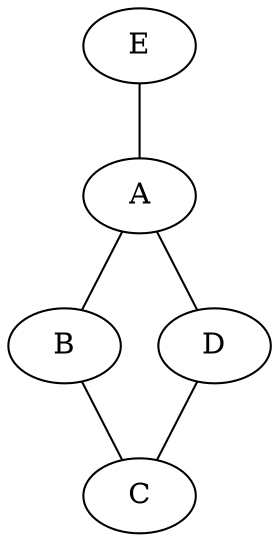
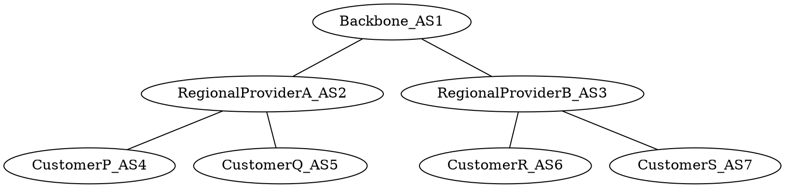

### Packet Fragmentation
Each link defines a **maximum transmission unit (MTU)**, which is the largest packet a link can transmit at once. If the incoming packet is too large, it is **fragmented**, sent across the link, and then **reassembled** at the destination.   
To reassemble, we need:
* Unique ID
* Fragment sequencing (index or offset)
* Marker for end of the packet
* Recomputed packet length (each fragment is an independent packet at the lower level)

Possible problems with fragmentation
* If a fragment is lost, the entire packet is dropped
* Multiple fragmentation at lower levels wastes space (e.g. given a packet of sizes 2000kb and a link with MTU 1500kb, the packet is split into 1500 + 500, latter fragment wastes space)

IP header can specify the **DF** flag to prevent fragmentation. If the packet length > MTU, packet is dropped

IP header components:

* Identifier: fragments form the same packet will have the same identifier
* Source: source of transmission
* Dest: destination of transmission
* IP Flags (e.g. 001) . Each is assigned a bit switch:
  * left: **reserved** bit, must be 0
  * middle: **DF** does not fragment
  * right: **MF** more fragments incoming
* Next protocol: layer 4 protocol (e.g. TCP, UDP)
* Header length: how big the header is in 4 byte sized words (usually $\geq$ 5 words long)
* Offset: fragment's offset from the original packet in 8 byte increments
* Header checkSum: used to catch packet errors
* TotalLength: size of packet (payload + header)

#### How Fragmentation Works
1. Divide packet payload into chunks such that payload + headerLength (usually 20B) $\leq$ MTU)
2. Flags are set to MF for all fragments except the last one, which has a flag of 0
3. Set fragment offset to the payload offset from the original packet (these are in 8 byte increments so a value of 1 corresponds to 8B offset)
4. Set totalLength to the length of the fragment
5. All other fields are the same except checksum
#### How Fragment Assembly Works
1. Wait for all fragments to arrive using the identifier, source, and dest header fields to connect fragments together
2. Use offset to determine the order and reconstruct packet

## Border Gateaway Protocol (BGP)
The Internet is huge, consisting of over 1 billion hosts bounded to names. Drawbacks of DV and LSR
* DV: enormous routing tables
* LSR: flooding enormous number of messages

This leads to **hierarchical routing**: use small subnets with small number of hosts and CIDR blocks that connect to the world through a single (or few) default gateway. Larger networks have multiple **peers** that are managed independently, referred to as **Autonomous Systems**. Here, we want to minimize **mutual dependencies** and limit the number of points of contacts.    
Peers have **contractual aggreements**: Service-Level Agreements that assign a monetary cost to data exchanges and govern traffic flow by policies    
    
### Policy Example

Simple policy: A will **transit** B's traffic to E but not to D    
Complex policy (from B): 
| Dest AS | Next AS | Cost/GB |
| ------- | ------- | ------- |
| D       | A       | $40     |
| D       | C       | $30     |
| E       | A       | $20     |

So $B$ prefers the path $C \rightarrow D$ over $A \rightarrow D$    
### AS Types
| Type              | # Peers | Transit allowed? |                                                |
| ----              | ------- | ---------------- | ---------------------------------------------- |
| Stub              | 1       | -                | "normal" org                                   |
| Multi-homed       | 2+      | no               | like stub but w/ redundant connections         |
| Transit           | 2+      | yes              | part of infrastructure so ASes can communicate |
### Protocol Requirements
**Border routers** (aka **Gateways** or **Provider edge routers**): connect ASes together
* Path from AS $A$ to AS $B$ that is **loop-free**
* All paths should be **policy-compliant**
* Protocol is **agnostic** to internal metrics of AS, only caring about **reachability**
* Each AS must have at least 1 **BGP Speaker**: "speaks" the BGP protocol (usually border router)
* BGP is a **path-vector** protocol: has complete paths to destinations $\implies$ can construct policy-compliant paths
### AS Naming
Every non-stub AS has a unique AS 32-bit number (no subnetting). These numbers are managed by IANA and RIR (similar to CIDR blocks). Common notations:
* asplain - decimal integer
* asdot - decimal integer if < 65536 else 2-part 16-bits separated by a dott
### How BGP Works

Each customer has 1 or more CIDR block (e.g.)
* P has $128.96.0.0/16, 194.4.153.0/24$
* Q has $192.4.32.0/24, 192.4.3.0/24$
* R has $192.12.69.0/24$
* S has $192.4.54.0/24, 192.4.23.9/24$

AS2 **advertises** $128.96.0.0/16, 194.4.153.0/24, 192.4.32.0/24, 192.4.3.0/24$. These are **directly reachable** from AS2.   
AS1 **advertises**  $128.96.0.0/16, 194.4.153.0/24, 192.4.32.0/24, 192.4.3.0/24$ **reachable** through the path <AS1, AS2>
### Features of Path-Vectors
Recv advertisements with a CIDR block include a **complete path** to the stub AS. When receiving we ask several questions
* Are in that path? Yes $\implies$ it's a loop so don't advertise it
* Does the path violate local policy? Yes $\implies$ don't advertise it

**Notes**:
* BGP speaker might not advertise any path to the destination for non-compliant policy paths
* If we have multiple, policy-equivalent paths, we choose the one with the fewest AS hops
### Path/Route Withdrawal
**Withdrawal**: Don't use this pathing anymore    
BGP uses TCP, which gives reliable transport
* If there is nothing new to advertise, BGP sends a **keep alive** message. But if we are missing a keepalives from $A$, we withdraw all paths going through $$
### Common Peering Relationships
**Provider-Customer**:
* $P$ sends all routes it knows to $C$
* $P$ sends all routes it receives from $C$ to all other nodes

**Customer-Provider**:
* $P$ sends to it's providers all routes it knows from $C$
* $P$ sends to $C$ routes from $P$'s providers
* $P$ does not advertise routes from it's providers to each other

**Peer**:
* $P$ sends to it's peer $P'$ routes from $C$
* $P$ sends $C$ routes from $P'$
* $P$ does not advertise provider's routes to $P'$
* $P$ does not send $P'$'s routes to providers
### BGP Interdomains
BGP creates **interdomain** paths betwen ASes  
* Stub AS: border router sends **default** routes to the internal protocol
* Mid-tier AS: border router **injects** specific routes from other ASes
* Tier-1 AS: runs **Interior BGP (iBGP)** which tells which boarder router handles a given external address, giving it internal routing to the boarder router

RIP, IS-IS, OSPF (based on DV and link-state protocols) create **intradomain** paths within ASes
### Multiple Border Routers
Large ASes often peer other large ASes
* Might have multiple points of contact
* Most ASes practice **early exit**: get traffic out of current AS as fast as possible (we don't know anything about the peer structure)
  * Usually leads to **asymmetric routes**, but these are often more efficient
### BGP Issues
ASes sometimes advertise wrong routes
* BGP can't prevent this (usually b/c of mistake e.g. incorrect advertisements). BGP can only operate on what it is told
  * 1-hop to prefixes they don't connect to
  * Shorter paths to other ASes
* Mistakes can also be created maliciously e.g. advertise a short route to a **black hole**: destination is unreachable to all/specific traffic (packets can enter it but can never get out)
