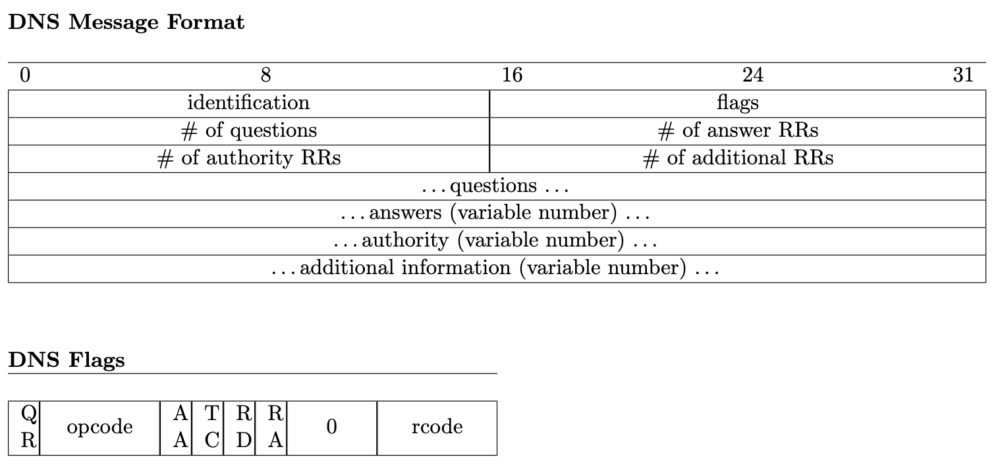
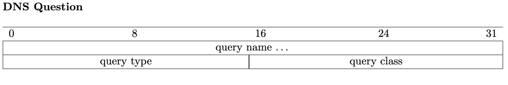
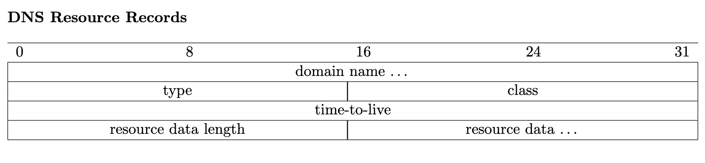

## Application Layer
### Domain Name System
In the old days, mapping from addresses to names were stored in `/etc/hosts`. However, the lookup file does not scale (need an entry for every host on the Internet).
* Today, posix requires an entry for 127.0.0.1 as localhost in `/etc/hosts`

Requirements for a DNS:
* **Name space**: set of possible names
  * **Flat**:
  * **Hierarchical**:
* **Bindings**: connections between **names** and **values**
* **Resolution mechanism**: tells how to discover the value for a name
* **Name server**: implementation of the resolution mechanism on the network
  * Must be query-able

DNS starts with a **name**: info that is useful for humans but not useful for routing/forwarding (`gethostbyname`, `getaddrinfo`)
* `nslookup`, `host`, `dig`: retrieves **records** for a name and can be run in **reverse**.
* `whois`: provides **registration** info (who owns the name, who sold it to them)
### Fully Qualified Domain Name (FQDN)
`gizmonic.cs.umd.edu`

FQDNs are separated by dots and resolve right to left.
* `edu`: top level
* `umd.edu`: refinement of above
* `cs.umd.edu`: refinement of above
* `gizmonic.cs.umd.edu`: host

DNS maps these names to **objects** that may or may not be addresses.

DNS is a **hierarchical** namespace
* `.`: **root domain** (usually omitted in names)
* set of (`edu`, `com`, `gov`, ...) **Top-Level Domains**

Subtrees are arranted into **zones** of administrative authority
* **Subdomains** can form new zones or let the parent domain's zone manage its names
* **Note**: zones have at least 2 name servers (serve as a backup)

Zone hierarchy
* `.` root name servers
  * .`edu` NS
    * `.umd.edu` NS

**Note**: NS can implement multiple zones
* **Zone info** = set of **resource records**

### Resource Record (RR)
`<name, val, type, class, TTL>`
* `type`: tells how to interpret the value

| type  | number | value                                                      |
| ----  | ------ | -------                                                    |
| A     | 1      | IP addr                                                    |
| NA    | 2      | DN of host with NS that can resolve further                |
| CNAME | 5      | canonical name (alias resolution)                          |
| SoA   | 6      | "start of authority" with zone info (NS, admin email, ...) |
| PTR   | 12     | pointer, returns CNAME for addr                            |
| HINFO | 13     | host info (not really used)                                |
| MX    | 15     | DN for host that handles emails for the domain             |
| AAAA  | 28     | IPv6 addr                                                  |
* `class`: usually `1` (`IN` or Internet Class). Other classes include
  * `CH`: chaos network
  * `HS`: Hesiod
* `TTL`: time in seconds that the record is still valid

* `ID` is chosen by the client. Used to match responses to queries

Flags:
* `QR`: 1 bit. Values are `0` for query, `1` for response
* `Opcode`: 4 bits. Values are `0` for standard query, `1` for inverse query, `2` for server status
* `AA`: 1 bit. Boolean if its authoritative
* `TC`: 1 bit. Boolean if its truncated (DNS usually uses UDP of size `512B`)
  * If it's truncated, must use TCP
* `RD`: 1 bit. Boolean for if recursion is desired.
* `RA`: 1 bit. Boolean if its recursion available.
* `0`: 3 bits. Always `0`.
* `rcode`: 4 bits. Values are `0` for no error, `3` for name error

* `Query names`: not padded and split on dots into **name segments**
  * Each segment is preceded by a 1B length (0-63)
  * Contents are stored as ASCII
  * NULL `0` at the end (represents terminating dot)
* `Query type`: any RR type or
  * `252`: AXFR (zone transfer)
  * `255`: ANY
* `Query class`: usually `1` (explained above)

PTR queries do **reverse lookups**
* `1.2.3.4` looks up `4.3.2.1.in-addr.arpa.`
  * This unique name is unroutable since it doesn't have an `A` record. The ptr record reports the canonical name at that address.

RR data format depends on the type
* Type 1 (`A`): `data length` is 4 bytes and the `data` is a 32-bit addr

### Recursive and Iterative Resolution
Client always asks local NS to resolve addrs
* Local NS might not know, but it knows who to ask next
  * Example: `host.cs.umd.edu` sends `en.wikipedia.org` to `ns1.cs.umd.edu` who doesn't know and forwards query to `ns1.umd.edu`. If it doesn't know, it asks the root `.org`. If it doesn't know, ask `ms1.wikipedia.org` who then resolves and sends back addr (`208.80.154.224`) back through all of the intermediate locations.
    * Intermediate locations also cache the result to save time for a future query of `ms1.wikipedia.org` so the local server can respond immediately.

**Iterative queries**: require the client to contact each NS in turn.
* Roots never allow recursion (puts too much burden on them)
* Intermediate (non-authoritative) servers can cache a RR until its `TTL` expires
  * Cached responses have `AA` = 0

### Answers
Answer RR are responses to a specific query
* Authority RRs tell the authoritative NS for a response
* Additional Info RRs provide **glue** records
  * Avoids circular dependencies
    * Example: we want `foo.example.com` and root tells us that `example.com` it provided by `ns1.example.com` who says `example.com` is provided by `ns1.example.com` which causes a loop.
    * This loop is prevented by adding ns1's `A` record into the additional information section

### Name Compression
The length field of name segments have a restrction of (`length < 64`). This is because **internal pointers** are used:
* If `length >= 192 (0xC0)` then it's 2B total with 14 bits of offset
  * offset is relative to the DNS packet data (after L4 header)
  * offset = 1st byte of name encoding
  * This reduces redundant information

### UDP, TCP, and Zone Transfers
All queries can use TCP but most use UDP (there's no overhead for UDP)
* If `TC = 1` then the UDP limit is too small so we need to re-issue over TCP
* Zone transfer `Q (AxFR)` must use TCP
  * includes all info for the zone, including all RRs
  * used by backup to get info from primary NS
* Note that UDp and TCP both use port `53`
